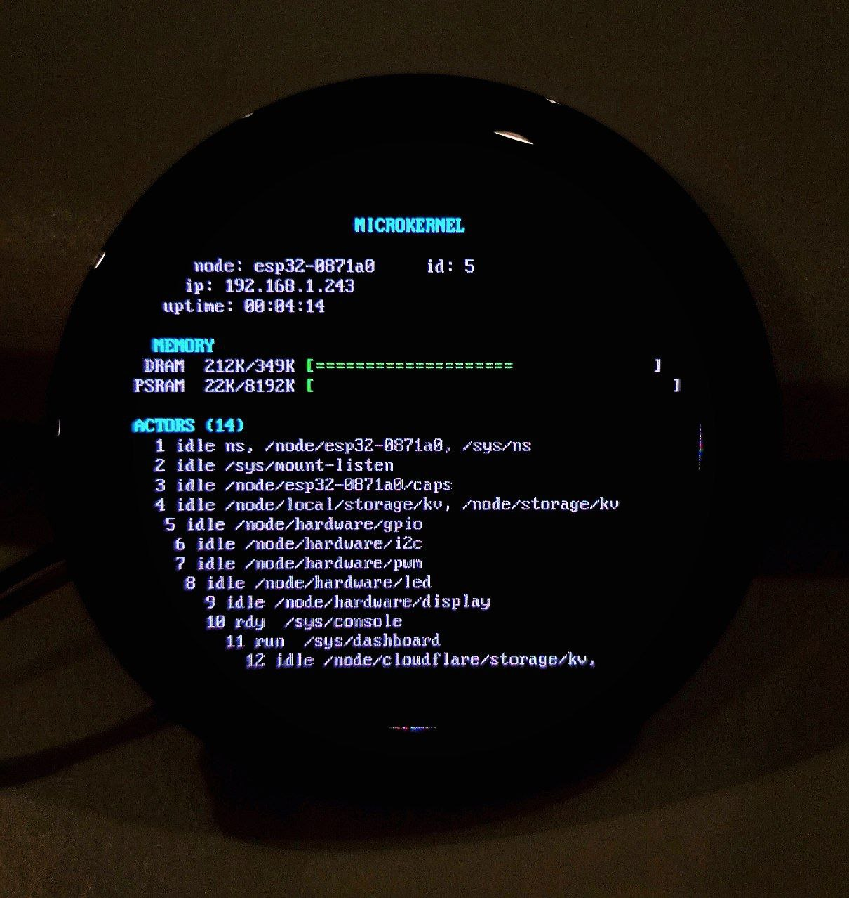
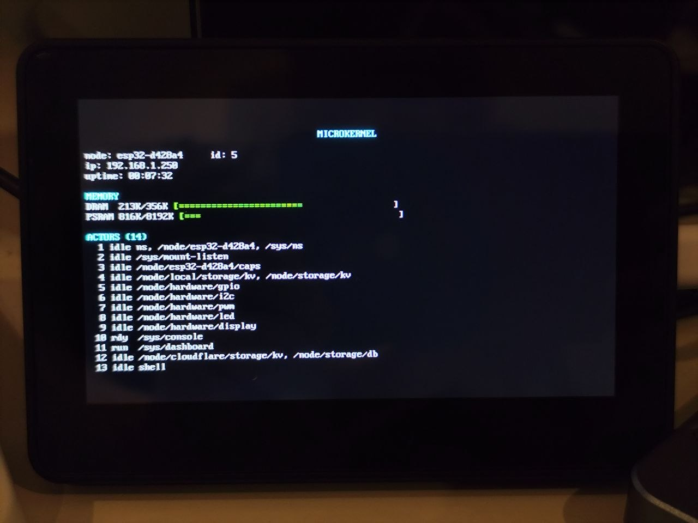

# Microkernel

Actor-based microkernel runtime in C for Linux and ESP32. Erlang-style supervision
trees, Go-style blocking concurrency via WASM fibers, and sandboxed actor isolation
via WAMR. All communication is asynchronous message passing over a cooperative
scheduler with integrated I/O polling.


*System dashboard on Waveshare ESP32-S3 AMOLED 1.43" — 14 actors, ANSI console with circular bezel layout*


*Same dashboard on Waveshare ESP32-S3-Touch-LCD-4.3B — 800x480 RGB LCD, full-width 100-column layout*

## Features

- **Actor model** -- message passing, mailboxes, cooperative round-robin scheduling
- **Supervision trees** -- one-for-one, one-for-all, rest-for-one restart strategies with rate limiting
- **Multi-node IPC** -- Unix domain sockets and TCP transport with binary wire protocol
- **Cross-node name registry** -- location-transparent `actor_send_named()` across nodes
- **Hierarchical namespace** -- `/`-prefixed path table, mount points, cross-node path sync
- **Dynamic node interconnection** -- `mount` protocol with hello handshake, automatic registry sync
- **Cloudflare integration** -- cf_proxy actor bridges local actors to Cloudflare Workers via WSS: KV storage, D1 SQL database, AI inference/embeddings, queue push; shell history persists across reboots
- **Capability advertisement** -- nodes report platform, features, and resource counts on request
- **Networking** -- TCP, UDP, DNS resolution via getaddrinfo
- **HTTP client/server** -- GET, POST, chunked transfer, request routing, response building
- **SSE client/server** -- event stream parsing and server push
- **WebSocket client/server** -- text/binary frames, ping/pong, upgrade handling, large frames up to 64KB with dynamic allocation
- **TLS** -- OpenSSL on Linux, mbedTLS on ESP32
- **Core services** -- timers (timerfd), FD watching, name registry, structured logging
- **WASM actors** -- spawn actors from `.wasm` bytecode via WAMR
- **WASM fibers** -- `mk_sleep_ms()` and `mk_recv()` for blocking-style concurrency in WASM
- **Hot code reload** -- atomic WASM module swap preserving names, mailbox, and supervisor state; shell `reload` command
- **Actor state persistence** -- file-backed binary save/load; WASM host functions `mk_save_state()`/`mk_load_state()` for cross-reload state preservation
- **Local KV storage** -- filesystem-backed key-value actor at `/node/storage/kv`, same interface as Cloudflare KV; works offline
- **Display + ANSI console** -- multi-board display stack with HAL abstraction: 466x466 AMOLED (SH8601 QSPI) and 800x480 LCD (ST7262 RGB parallel); 8x16 font rendering, virtual terminal with dynamic grid sizing (58x29 or 100x30), ANSI escape sequence parsing, dirty-row tracking; dashboard auto-adapts layout (circular bezel margins vs full-width rectangular); board selected at build time via `idf.py menuconfig`
- **MIDI** -- full MIDI actor for SC16IS752 UART-to-I2C bridge (31250 baud); interrupt-driven receive with byte parser (running status, SysEx, real-time interleaving), subscriber dispatch with channel/message filtering; MIDI monitor actor (human-readable traffic logging); arpeggiator actor (UP/DOWN/UPDOWN/RANDOM patterns, 1-4 octave range, BPM-driven 16th-note stepping, legato output, enable/disable)
- **Hardware actors** -- GPIO (digital I/O with interrupt-driven events), I2C (master bus), PWM (duty-cycle control via LEDC), addressable LED (WS2812/NeoPixel strips); message-based HAL abstraction works on both ESP32 and Linux (mock)
- **Interactive shell** -- native C shell with readline (arrow-key history, line editing), system introspection (`info`/`top`), actor management, hex-encoded binary payloads; runs over UART/stdin on ESP32 or terminal on Linux
- **ESP32 port** -- full feature parity on ESP32-S3 (Xtensa), ESP32-C6 and ESP32-P4 (RISC-V), including networking, TLS, WASM, hot reload, hardware actors, display, and interactive shell

## Building (Linux)

```bash
cmake -B build -DCMAKE_BUILD_TYPE=Debug
cmake --build build
ctest --test-dir build
```

46 tests pass. OpenSSL is detected automatically; if absent, TLS URLs return errors
while everything else works. WASM support requires clang for compiling `.wasm` test
modules and optionally `wat2wasm` (from wabt) for zero-linear-memory WAT modules.
The WAMR submodule auto-initializes on first build.

### CMake options

| Option | Default | Description |
|---|---|---|
| `ENABLE_WASM` | ON | WASM actor runtime via WAMR |
| `CF_PROXY_DEBUG` | OFF | Verbose cf_proxy and WebSocket frame logging |
| `BUILD_REALWORLD_TESTS` | OFF | Tests that hit the public network |
| `BUILD_BENCHMARKS` | OFF | HTTP and actor throughput benchmarks |

## Building (ESP32)

```bash
cd platforms/esp32
cp main/wifi_config.h.example main/wifi_config.h  # edit with WiFi credentials
idf.py set-target esp32s3  # or esp32c6, esp32p4
idf.py build flash monitor
```

Runs 18 smoke tests on boot (6 on chips without WiFi). Tested on:

- **ESP32-S3** (Xtensa) -- TinyS3, Waveshare AMOLED 1.43", Waveshare LCD 4.3B -- 18 tests
- **ESP32-C6** (RISC-V) -- ESP32-C6-DevKit, C6-Zero -- 18 tests
- **ESP32-P4** (RISC-V dual-core) -- ESP32-P4 -- 6 tests (no WiFi radio)

For boards with displays, select the target board before building:

```bash
idf.py menuconfig  # → Microkernel Board → select your board
```

| Board | Display | Resolution | Interface |
|---|---|---|---|
| Waveshare AMOLED 1.43" | SH8601 | 466x466 | QSPI |
| Waveshare LCD 4.3B | ST7262 | 800x480 | RGB parallel |

The build system auto-selects the correct fiber implementation (Xtensa register
window spill vs RISC-V direct stack switch) and compiles out WiFi-dependent
tests on chips without a radio.

**ESP-IDF version notes:** Use ESP-IDF v5.5+ for S3 and C6 targets. The P4
requires v5.4.x for early silicon (rev 1.x) -- v5.5 generates instructions
unsupported on pre-production P4 chips.

## Quick example

Ping-pong between two actors:

```c
#include "microkernel/runtime.h"
#include "microkernel/actor.h"
#include "microkernel/message.h"

typedef struct { actor_id_t peer; int count; } state_t;

static bool ping(runtime_t *rt, actor_t *self, message_t *msg, void *s) {
    (void)self;
    state_t *st = s;
    if (msg->type == 1 && ++st->count < 5)
        actor_send(rt, st->peer, 1, NULL, 0);
    else { actor_stop(rt, st->peer); return false; }
    return true;
}

static bool pong(runtime_t *rt, actor_t *self, message_t *msg, void *s) {
    (void)self; (void)s;
    if (msg->type == 1) actor_send(rt, msg->source, 1, NULL, 0);
    return true;
}

int main(void) {
    runtime_t *rt = runtime_init(1, 16);
    state_t ps = {0}, qs = {0};
    actor_id_t a = actor_spawn(rt, ping, &ps, NULL, 16);
    actor_id_t b = actor_spawn(rt, pong, &qs, NULL, 16);
    ps.peer = b; qs.peer = a;
    actor_send(rt, a, 1, NULL, 0);
    runtime_run(rt);
    runtime_destroy(rt);
}
```

### WASM actor in Rust

Actors can be written in any language that compiles to WASM. Here is a Rust actor
that echoes messages back to the sender, with a sleep to demonstrate fiber-based
cooperative yielding:

```rust
// actor.rs -- compile with: rustup target add wasm32-unknown-unknown
//   cargo build --target wasm32-unknown-unknown --release
#![no_std]
#![no_main]

extern "C" {
    fn mk_send(dest: i64, msg_type: i32, payload: *const u8, size: i32) -> i32;
    fn mk_sleep_ms(ms: i32) -> i32;
}

const MSG_PING: i32 = 200;
const MSG_PONG: i32 = 201;

#[no_mangle]
pub extern "C" fn handle_message(
    msg_type: i32,
    source: i64,
    payload: *const u8,
    payload_size: i32,
) -> i32 {
    match msg_type {
        MSG_PING => unsafe {
            // Yield to the runtime for 100ms -- other actors keep running
            mk_sleep_ms(100);
            // Resumed after sleep; echo the payload back
            mk_send(source, MSG_PONG, payload, payload_size);
            1 // keep alive
        },
        0 => 0, // stop
        _ => 1, // ignore
    }
}

#[panic_handler]
fn panic(_: &core::panic::PanicInfo) -> ! { loop {} }
```

Spawn it from C (or from another WASM actor):

```c
wasm_actors_init();
runtime_t *rt = runtime_init(1, 16);
actor_id_t wasm = actor_spawn_wasm_file(rt, "actor.wasm", 16,
                                          WASM_DEFAULT_STACK_SIZE,
                                          WASM_DEFAULT_HEAP_SIZE,
                                          FIBER_STACK_SMALL);
actor_send(rt, wasm, 200, "hello", 5);
runtime_run(rt);
```

The same `.wasm` binary runs on both Linux and ESP32 without recompilation.

### WASM actor in Zig

```zig
// actor.zig -- compile with:
//   zig build-lib -target wasm32-freestanding -dynamic -O ReleaseSmall actor.zig
extern "env" fn mk_send(dest: i64, msg_type: i32, payload: [*]const u8, size: i32) i32;
extern "env" fn mk_sleep_ms(ms: i32) i32;

const MSG_PING: i32 = 200;
const MSG_PONG: i32 = 201;

export fn handle_message(
    msg_type: i32,
    source: i64,
    payload: [*]const u8,
    payload_size: i32,
) i32 {
    switch (msg_type) {
        MSG_PING => {
            _ = mk_sleep_ms(100);
            _ = mk_send(source, MSG_PONG, payload, payload_size);
            return 1;
        },
        0 => return 0,
        else => return 1,
    }
}
```

### WASM actor in Go

Requires [TinyGo](https://tinygo.org/) for bare WASM output (no WASI):

```go
// actor.go -- compile with:
//   tinygo build -o actor.wasm -target wasm -scheduler=none -no-debug .
package main

//go:wasmimport env mk_send
func mk_send(dest int64, msgType int32, payload *byte, size int32) int32

//go:wasmimport env mk_sleep_ms
func mk_sleep_ms(ms int32) int32

const (
	msgPing = 200
	msgPong = 201
)

//export handle_message
func handleMessage(msgType int32, source int64, payload *byte, payloadSize int32) int32 {
	switch msgType {
	case msgPing:
		mk_sleep_ms(100)
		mk_send(source, msgPong, payload, payloadSize)
		return 1
	case 0:
		return 0
	default:
		return 1
	}
}

func main() {}
```

### Interactive shell

The microkernel includes a native C shell (`mk-shell v0.3`) running as an actor
inside the runtime. A console actor bridges platform I/O (UART on ESP32,
stdin on Linux) into the actor message loop, with a reusable readline library
providing arrow-key command history, line editing, and escape sequence handling.

```
mk-shell v0.3 (native)
Type 'help' for commands.

> list
  SEQ  ID                STATUS   MBOX  NAME
  1    0x000010000000001 idle     0/16  shell
  2    0x000010000000002 idle     0/16  /sys/mount-listen
  3    0x000010000000003 idle     0/16  ns
  4    0x000010000000004 idle     0/16  console
  5    0x000010000000005 idle     0/16  local_kv
  6    0x000010000000006 idle     0/16  cf_proxy
                                        /node/storage/kv
                                        /node/storage/db
                                        /node/queue/default
                                        /node/ai/infer
                                        /node/ai/embed
> info
Actors: 6 active
  SEQ  ID                STATUS   MBOX  PARENT            NAME
  1    0x000010000000001 idle     0/64  ---               ns
  2    0x000010000000002 idle     0/16  ---               /sys/mount-listen
  3    0x000010000000003 idle     0/16  ---               console
  4    0x000010000000004 idle     0/16  ---               local_kv
  5    0x000010000000005 idle     0/32  ---               cf_proxy
  6    0x000010000000006 running  0/32  ---               shell

Heap: 213 KB free / 327 KB (min 212 KB, largest 128 KB)
  DRAM:  213 KB free / 327 KB
> load echo.wasm
Spawned actor 7 as 'echo'
> call echo 200 hello
[reply] type=201 from=0x0100000000007 size=5 "hello"
> stop echo
Stopped actor 0x0100000000007
> exit
Goodbye.
```

Commands: `help`, `list`, `info` (alias `top`), `self`, `whoami`,
`load <path>`, `reload <name> <path>`, `send <name-or-id> <type> [data|x:hex]`,
`call <name-or-id> <type> [data|x:hex]`, `stop <name-or-id>`,
`register <name>`, `lookup <name>`, `ls [/prefix]`,
`mount <host>[:<port>]`, `caps [target]`, `exit`

The `send` and `call` commands accept an optional `x:` prefix on the payload to
send hex-encoded binary data (e.g., `call led 4278190145 x:0000ff000000` sends
6 raw bytes). This is essential for hardware actors that use binary struct
payloads.

The `info` command shows per-actor details (mailbox usage, parent, all registered
names) and on ESP32 includes heap breakdown (DRAM/PSRAM, free, watermark, largest
free block). Actors with multiple registered names display each name on its own
aligned continuation line.

Loaded WASM actors are auto-registered by filename (`echo.wasm` becomes `echo`;
duplicates get `echo_1`, `echo_2`, etc.). The `call` command sends a message and
waits up to 5 seconds for a reply.

The readline library (`mk_readline.h`) is reusable outside the shell -- it
provides history browsing (up/down arrows), cursor movement (left/right, Home,
End), word/line kill (Ctrl+U/K/W), and insert-anywhere editing with no
heap allocation.

### Cloudflare cloud services

The `cf_proxy` actor maintains a persistent WSS connection to a Cloudflare Worker,
giving every node transparent access to cloud services through virtual namespace
paths. Local actors send simple `key=value\n` payloads; the proxy translates to
JSON over WebSocket; the Worker handles server-side key prefixing by node identity.

| Service | Virtual path | Cloudflare binding |
|---|---|---|
| Key-value store | `/node/storage/kv` | Workers KV |
| SQL database | `/node/storage/db` | D1 |
| Message queue | `/node/queue/default` | Queues |
| Text inference | `/node/ai/infer` | Workers AI |
| Embeddings | `/node/ai/embed` | Workers AI |

Cloudflare is the guaranteed floor -- always reachable. Virtual paths resolve to
the best available implementation: local flash/RAM > mounted peer > Cloudflare.
Actors address services by name, never by backend.

The shell's `history` command uses KV storage to persist command history across
reboots -- the acceptance test for the integration. Configuration:

```bash
# Linux: environment variables
MK_CF_URL="wss://your-worker.workers.dev/ws" MK_CF_TOKEN="secret" ./mk-shell

# ESP32: create platforms/esp32/main/cf_config.h (gitignored)
#define CF_PROXY_URL   "wss://your-worker.workers.dev/ws"
#define CF_PROXY_TOKEN "secret"
```

Deploy the Worker:

```bash
cd platforms/cloudflare/worker
npm install
npx wrangler deploy
npx wrangler secret put AUTH_TOKEN
```

### Hardware actors

Hardware peripherals are exposed as actors with binary struct payloads. Each
actor follows the same HAL pattern: a private `*_hal.h` interface with a mock
implementation for Linux testing and a real implementation for ESP32. All
hardware actors register under `/node/hardware/` in the namespace.

| Actor | Namespace path | ESP32 driver |
|---|---|---|
| GPIO | `/node/hardware/gpio` | `gpio_isr_handler` + edge filtering |
| I2C | `/node/hardware/i2c` | Legacy `driver/i2c.h` master API |
| PWM | `/node/hardware/pwm` | LEDC (low-speed mode, 6 channels) |
| LED | `/node/hardware/led` | `led_strip` component (RMT, WS2812) |
| Display | `/node/hardware/display` | SH8601 QSPI or ST7262 RGB (board-selected) |
| MIDI | `/node/hardware/midi` | SC16IS752 dual UART via I2C |

**GPIO** supports digital read/write, configurable input/output modes, and
interrupt-driven event subscriptions. Pin state changes are delivered as
`MSG_GPIO_EVENT` messages to subscribed actors.

**I2C** provides master-mode bus access: write, read, write-then-read, and bus
scan. All operations are synchronous request/response with binary struct
payloads.

**PWM** controls duty cycle on up to 6 channels. Configure a channel with pin,
frequency, and resolution (8/10/12/14-bit), then set duty cycle.

**LED** drives WS2812/NeoPixel addressable LED strips (up to 256 LEDs).
Supports per-pixel color, bulk set, global brightness scaling, and explicit
show/clear. `SET_PIXEL` does not auto-flush (batch-friendly); call `SHOW` to
push pixels to hardware. `SET_ALL` and `CLEAR` auto-flush.

**Shell example** -- control the onboard RGB LED on an ESP32-C6 from the
interactive shell using hex-encoded binary payloads (`x:` prefix):

```
> call led 4278190144 x:08000100
[reply] type=4278190156 from=12 size=0 ""
> call led 4278190145 x:0000ff000000
[reply] type=4278190156 from=12 size=0 ""
> call led 4278190149
[reply] type=4278190156 from=12 size=0 ""
```

The three calls above: (1) configure pin 8, 1 LED; (2) set pixel 0 to red
(R=0xFF, G=0x00, B=0x00); (3) show (flush to hardware). Message types are
decimal representations of `MSG_LED_CONFIGURE` (0xFF000040), `MSG_LED_SET_PIXEL`
(0xFF000041), and `MSG_LED_SHOW` (0xFF000045). The `x:` prefix tells the shell
to decode the hex string into a binary payload instead of sending it as text.

### MIDI

The MIDI actor drives an SC16IS752 dual UART-to-I2C bridge for standard
MIDI IN/OUT at 31250 baud. Channel A handles receive (interrupt-driven via
IRQ pin), Channel B handles transmit. The byte-level parser handles running
status, SysEx accumulation (up to 256 bytes), and real-time message interleaving
(clock/start/stop processed without disrupting parse state).

Actors subscribe to MIDI events with optional channel and message-type filters:

```c
midi_subscribe_payload_t sub = {
    .channel = 0xFF,            /* 0xFF = all channels */
    .msg_filter = MIDI_FILTER_NOTE | MIDI_FILTER_CC
};
actor_send(rt, midi_id, MSG_MIDI_SUBSCRIBE, &sub, sizeof(sub));
```

Two higher-level actors build on the MIDI actor:

- **MIDI Monitor** (`/sys/midi_monitor`) -- subscribes to all MIDI traffic and
  prints human-readable output: note names with octaves, CC numbers, pitch bend
  values, SysEx hex dumps
- **Arpeggiator** (`/sys/arpeggiator`) -- holds notes from MIDI IN and generates
  arpeggiated patterns on MIDI OUT. Supports UP, DOWN, UPDOWN (bounce without
  endpoint repeat), and RANDOM patterns across 1-4 octaves. BPM-driven 16th-note
  stepping with legato output (Note On before Note Off). Configurable via messages:
  `MSG_ARP_SET_BPM`, `MSG_ARP_SET_PATTERN`, `MSG_ARP_SET_OCTAVES`, `MSG_ARP_ENABLE`

## Project structure

```
include/microkernel/    Public headers (types, runtime, actor, message, services,
                        transport, http, mk_socket, mk_readline, shell,
                        supervision, wasm_actor, namespace, cf_proxy,
                        gpio, i2c, pwm, led, display, console, dashboard,
                        midi, midi_monitor, arpeggiator)
src/                    Implementation (runtime, actors, transports, HTTP state
                        machine, supervision, wasm_actor, hot reload, namespace,
                        cf_proxy, local_kv, state_persist, shell, readline,
                        hardware actors, MIDI actor + monitor + arpeggiator,
                        HAL interfaces + Linux mocks, wire format, utilities)
tests/                  46 unit/integration tests + realworld tests + benchmarks
tests/wasm_modules/     WASM test module source (C and WAT)
tools/shell/            Shell driver (C console actor + mk-shell binary)
third_party/wamr/       WAMR submodule (pinned to WAMR-2.2.0)
platforms/esp32/        ESP-IDF project (components: microkernel, microkernel_hal)
platforms/cloudflare/   Cloudflare Worker (mk-proxy) for cloud KV, D1, AI
docs/                   Architecture, API reference, examples, development guide
```

## Dependencies

**Required:** libc, pthreads.

**Optional:** OpenSSL (TLS on Linux), WAMR (WASM actors, default ON via submodule).

**ESP32:** ESP-IDF v5.5+ (includes mbedTLS, lwIP, FreeRTOS). The `led_strip`
component is fetched automatically from the IDF component registry on first build.

## Documentation

- [Architecture](docs/architecture.md) -- system design, event loop, state machines
- [API Reference](docs/api.md) -- public functions and types
- [Examples](docs/examples.md) -- runnable code for each feature
- [Development Guide](docs/development.md) -- build system, testing, contributing

## License

BSD 3-Clause (non-commercial). Commercial license available -- contact
chris@foundation42.org.
